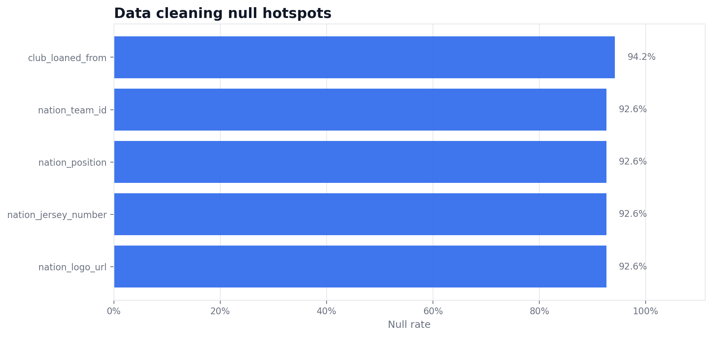
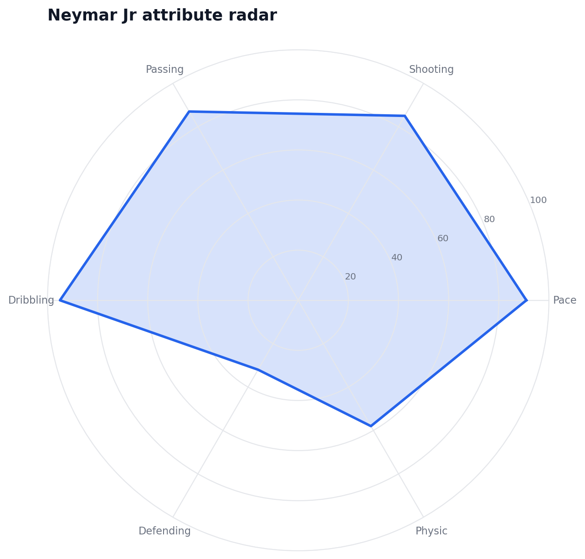
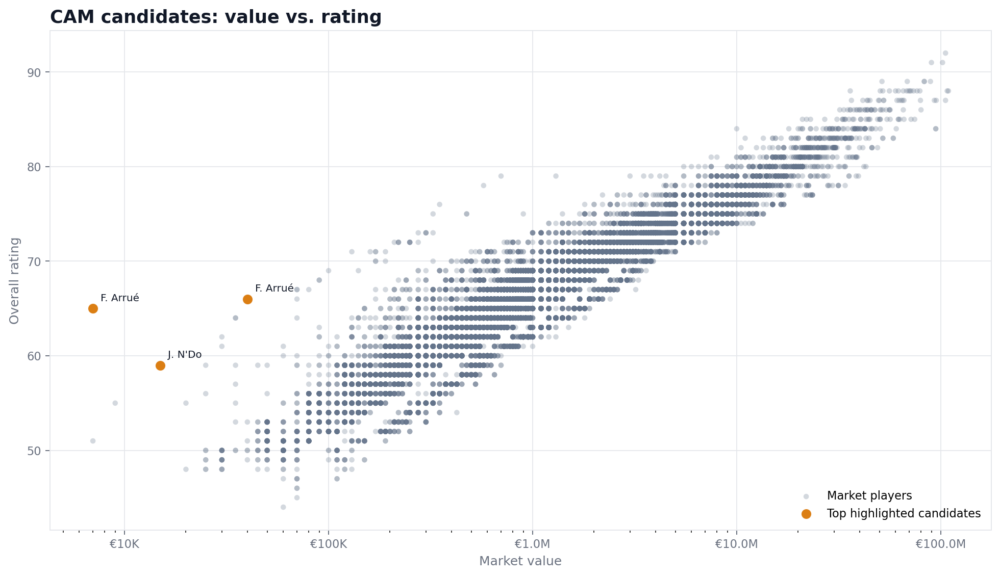
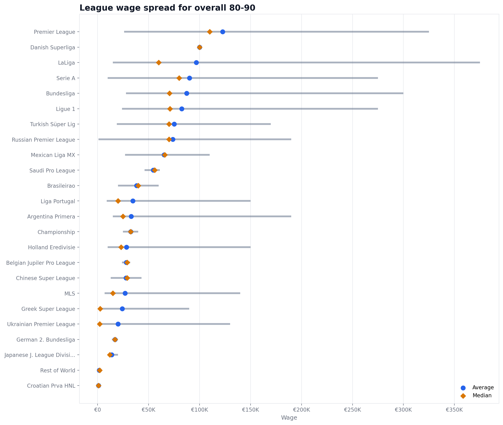
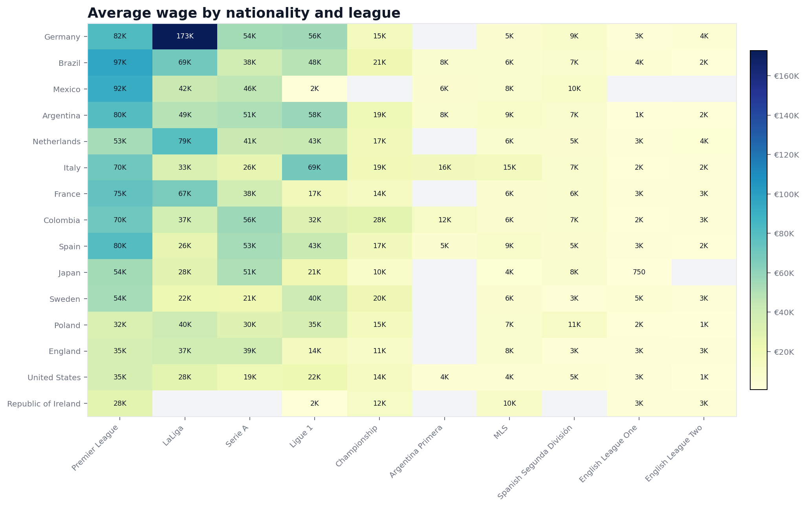
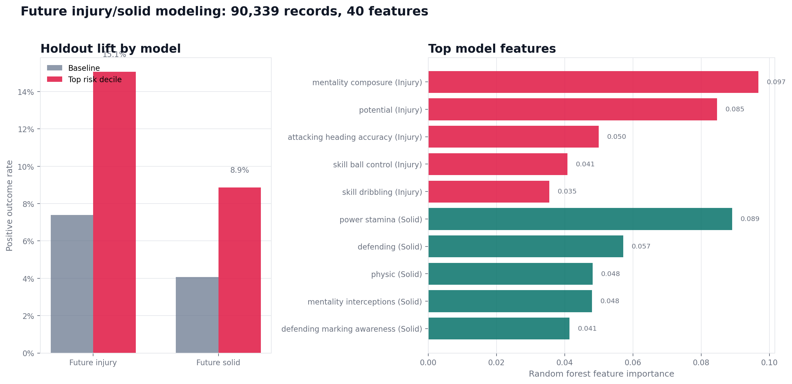
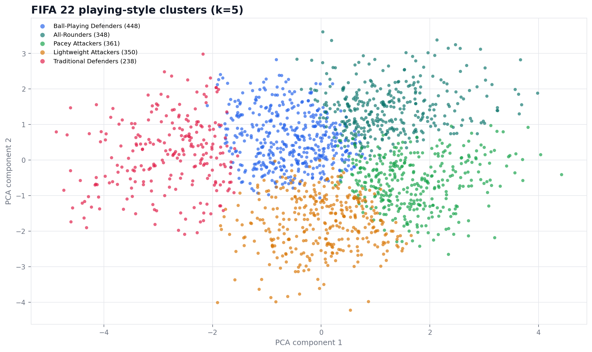
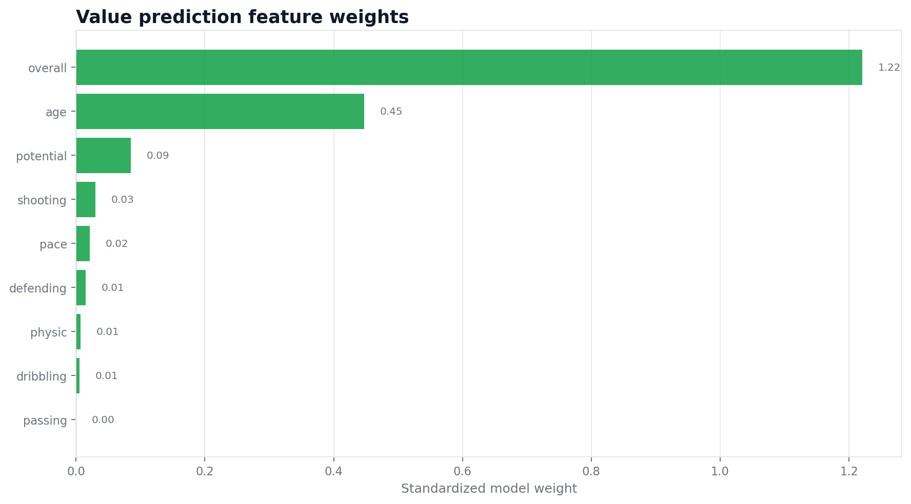

# FIFA Player Data Analysis System Project Report

## Abstract

This project implements a full-stack FIFA player analytics system for the Software Development Workshop II group project. The system combines a FastAPI backend, a Next.js dashboard, a cleaned FIFA 15-22 player archive, and five analysis scenarios: data loading and exploration, player value-for-money ranking, salary fairness analysis, future injury/solid trait projection, and advanced playing-style clustering with market-value prediction. The current backend loads 144,323 player-season snapshots from the local CSV archive, normalizes market and ability fields, expands position-rating strings into analyzable numeric columns, and writes a tidy Parquet cache with 195 cleaned columns. The frontend exposes the project through scenario-specific dashboard pages, while exported PNG charts provide static evidence for reporting. Results show that the data pipeline is stable, the value-for-money module can surface low-cost candidates, league wage distributions differ significantly for high-rated players, the injury module can flag higher-risk held-out player seasons, and FIFA 22 outfield players can be segmented into interpretable playing-style clusters. The report documents the system design, methods, outputs, limitations, and future work.

## 1. Introduction

Football player recruitment depends on balancing player quality, market price, wages, age, potential, and tactical fit. FIFA career-mode datasets provide a practical data source for exploring these questions because they include player attributes, club context, nationality, league, market value, wage, and position data across multiple yearly game editions.

The goal of this project is to build an interactive player analytics system around this dataset. The system is designed for five main scenarios:

1. Loading, cleaning, and exploring the FIFA archive.
2. Ranking value-for-money candidates for a selected position.
3. Investigating salary fairness across leagues and nationalities.
4. Predicting whether early unlabeled player seasons later become Injury Prone or Solid Player records.
5. Applying clustering and regression models for advanced analysis.

The project is implemented as a working web application rather than a standalone notebook. This makes the analysis reproducible through API endpoints, reusable through typed frontend components, and presentable through dashboard pages and exported report figures.

## 2. Project Scope and Requirements

The repository contains a FastAPI backend under `app/`, a Next.js frontend under `web/`, raw and processed data under `data/`, implementation notes under `docs/plans/`, and generated analysis assets under `outputs/`. The backend exposes endpoints for dataset summaries, cleaning reports, value-for-money ranking, salary fairness, nationality heatmaps, future injury risk, K-Means clustering, and Ridge regression based value prediction.

The frontend is organized around five dashboard routes:

| Route | Scenario | Main purpose |
|---|---|---|
| `/explore` | Data loading and exploration | Dataset shape, schema preview, cleaning steps, and null hotspots |
| `/value-for-money` | Player value-for-money | Candidate ranking, radar comparison, and value-rating scatter plot |
| `/fairness` | Salary fairness | League wage distributions and nationality wage heatmap |
| `/injury` | Injury and solid projection | Future trait modeling, risk lift, feature importance, and validation timelines |
| `/advanced` | Advanced analysis | Playing-style clusters and value prediction diagnostics |

The system also includes local fallback data so that frontend pages remain renderable when the backend is unavailable. This supports parallel frontend and backend development during group work.

## 3. Dataset and Data Processing

The raw data consists of yearly FIFA player CSV files and supporting XLSX archives. The backend currently detects and loads the CSV archive from `data/raw/`. The dataset summary reports 144,323 player-season rows across FIFA editions 15 to 22 and both male and female player groups. The raw schema contains 110 source columns, while the cleaned tidy dataset expands to 195 columns after position-rating parsing.

The data repository performs the following ETL steps:

1. Load yearly CSV snapshots and add `season`, `gender`, and `source_file` fields.
2. Normalize player identifiers, ratings, market values, wages, and ability attributes into nullable numeric types.
3. Parse 27 position rating fields, such as `cam` or `rb`, into base, modifier, and effective rating columns.
4. Remove duplicate player-season rows using `(season, gender, sofifa_id)` when duplicates exist.
5. Write `data/processed/players_tidy.parquet` and `data/processed/cleaning_report.json`.

The current cleaning report indicates that no duplicate player-season rows were removed and no numeric coercion failures were detected. The main post-cleaning null hotspots are national-team and loan-related fields, which is expected because only a subset of players are assigned to national squads or are on loan.



**Figure 1.** The largest missing-value rates are concentrated in `club_loaned_from` and national-team fields. These fields are context-dependent rather than core player-quality attributes, so they do not block the main analysis scenarios.

## 4. System Architecture

The system follows a thin router-service-schema backend structure. FastAPI routers define public API contracts, service modules implement the analysis logic, and Pydantic schemas define response models. This separation allows each group member to work on one analysis area without changing unrelated endpoints.

The main backend modules are:

| Module | Responsibility |
|---|---|
| `app/services/data_repository.py` | CSV loading, cleaning, cache management, and column-level access |
| `app/services/dataset.py` | Dataset summary and cleaning report construction |
| `app/services/vfm.py` | Value-for-money ranking and candidate chart data |
| `app/services/fairness.py` | League wage distributions, Kruskal-Wallis test, and nationality heatmap |
| `app/services/injury.py` | Future Injury Prone and Solid Player trait projection |
| `app/services/advanced.py` | K-Means/PCA clustering and Ridge regression value prediction |

The frontend uses Next.js App Router pages and shared components for charts, cards, tables, forms, and navigation. Generated OpenAPI types are present under `web/lib/generated/`, which keeps the frontend contract aligned with the backend API.

## 5. Analysis Methods

### 5.1 Value-for-Money Ranking

The value-for-money module filters players by position and maximum market value. It ranks candidates using the project formula:

```text
VfM index = overall / log(value_eur + 1)
```

This favors players with strong overall ratings relative to their market value. The current CAM analysis uses a maximum value threshold of 120,000,000 EUR. Neymar Jr is selected as the benchmark player because he has the highest combined overall and potential among the filtered candidate pool. The top CAM candidates by this formula include low-cost older players such as F. Arrue and J. N'Do, showing that the metric strongly rewards low market value.



**Figure 2.** The radar chart summarizes the selected benchmark's core position attributes. It supports quick comparison between ranked candidates and a high-profile reference player.



**Figure 3.** The market scatter places player overall rating against market value on a log scale. Highlighted candidates are those surfaced by the value-for-money ranking.

### 5.2 Salary Fairness Analysis

The fairness module focuses on high-rated players with overall ratings between 80 and 90. It groups wages by league and computes minimum, median, average, and maximum wages. Groups with fewer than two players are excluded from the statistical test.

The backend applies a Kruskal-Wallis H-test to compare league wage distributions. When SciPy is available, `scipy.stats.kruskal` is used; otherwise, the service falls back to a pure-Python chi-square approximation. The current test result is significant, with statistic 1088.726 and p-value approximately `1.76e-215`, indicating that high-rated player wages differ strongly across leagues. Dunn-style post-hoc comparisons identify especially large differences involving the English Premier League.



**Figure 4.** Wage ranges for high-rated players differ substantially by league. The English Premier League has the highest average wage in the current result set, while other leagues show lower medians and narrower ranges.

The nationality heatmap summarizes average wages for the top 10 leagues and top 15 nationalities. This limits sparsity while still showing cross-league and cross-nationality patterns.



**Figure 5.** The heatmap uses average wage per nationality-league cell. Blank cells indicate combinations with no qualifying players in the selected top categories.

### 5.3 Future Injury and Solid Projection

The injury module studies player trait changes over time. It maps the FIFA `player_traits` text into three states: unlabeled (`-1`), Solid Player (`0`), and Injury Prone (`1`). The modeling dataset keeps male FIFA 15-22 records and uses early unlabeled player seasons that have later records. From these rows, the service trains two separate Random Forest classifiers:

1. `future_injury`: whether a currently unlabeled season later becomes an Injury Prone player record.
2. `future_solid`: whether a currently unlabeled season later becomes a Solid Player record.

The current injury pipeline covers 45,629 male players and 142,079 total male records. It uses 90,339 modeling records and 40 numeric features, including age, body measurements, overall, potential, aggregate attributes, technical skills, movement, power, mentality, and defending ratings. Validation uses player-group holdout splitting, so the same player cannot appear in both train and test rows.

For the future injury model, the baseline positive rate is 7.4%. The top risk decile reaches a 15.1% positive rate on held-out players, with accuracy 0.727, precision 0.124, recall 0.464, and F1 score 0.195. Important features include mentality composure, potential, heading accuracy, ball control, dribbling, age, and overall. For the future solid model, the baseline positive rate is 4.1%, while the top risk decile reaches 8.9%. Its most important features include stamina, defending, physic, interceptions, marking awareness, standing tackle, aggression, sliding tackle, strength, and overall.



**Figure 6.** The future trait chart compares baseline rates with top-decile holdout rates and shows the leading Random Forest feature importances for injury and solid projections.

### 5.4 Playing-Style Clustering

The advanced analysis module clusters FIFA 22 outfield players using six aggregate attributes: pace, shooting, passing, dribbling, defending, and physic. Goalkeepers are excluded because their attribute structure differs from outfield players. The model standardizes the features, applies K-Means with `k=5`, and projects points into two PCA components for visualization.

The current clustering run uses 17,450 FIFA 22 outfield players and labels the clusters based on their attribute profiles:

| Cluster label | Count | Profile summary |
|---|---:|---|
| Ball-Playing Defenders | 4,504 | Balanced defensive and passing profile |
| All-Rounders | 3,318 | Strong all-around attributes |
| Pacey Attackers | 3,585 | High pace and attacking attributes |
| Lightweight Attackers | 3,304 | Dribbling and pace with lower defending and physic |
| Traditional Defenders | 2,739 | Defensive and physical profile with limited shooting |



**Figure 7.** PCA projection of the K-Means clusters. The labels are interpretable football role profiles rather than raw cluster IDs.

### 5.5 Market-Value Prediction

The prediction module trains a Ridge regression model on FIFA 22 outfield players. The target is `log1p(value_eur)`, and the features are overall, potential, age, pace, shooting, passing, dribbling, defending, and physic. The model uses an 80/20 train-test split with random state 42 and Ridge alpha 10.0.

The current model trains on 13,664 rows and tests on 3,417 rows. It achieves an R2 score of 0.971 and a mean absolute error of approximately 654,442 EUR. For the sample prediction request used by the exported chart, the estimated value is 110,692,369 EUR. Feature weights show that overall rating is the strongest predictor, followed by age and potential.



**Figure 8.** Standardized Ridge model feature weights. Overall rating dominates the model, while age and potential provide additional signal.

## 6. Results and Discussion

The project successfully turns the FIFA archive into a working analytics application. The data layer can load the full CSV archive, generate a tidy Parquet cache, and expose consistent summaries to the frontend. The value-for-money module demonstrates that a simple logarithmic cost adjustment can find inexpensive candidates, but it also shows a limitation: very low market values can dominate the ranking. A practical recruitment workflow should therefore combine this score with age, potential, league quality, playing time, and scouting constraints.

The fairness results show strong league wage differences among high-rated players. The Kruskal-Wallis p-value is extremely small, so the analysis supports the conclusion that league context is a major wage driver. However, this result should not be interpreted as unfairness by itself. League revenue, country economics, club budgets, player age, contract length, and star power are confounding factors that are not fully controlled in the current implementation.

The injury and solid projection module adds a longitudinal analysis scenario. Its strongest practical output is not a perfect classifier, but a risk-lift dashboard: the highest-risk held-out injury decile has about twice the baseline future injury rate. This makes the model useful for prioritizing review lists, while still requiring careful interpretation because the target labels come from FIFA trait annotations rather than medical records.

The clustering module creates interpretable player-role groups from six standard FIFA attributes. This is useful for browsing tactical profiles, but cluster labels are heuristic and should be validated by domain review. The value prediction model performs well numerically, with R2 of 0.971 on the held-out split, but this high score is expected because FIFA market values are strongly tied to overall rating and potential. The model is best treated as a diagnostic baseline rather than a causal valuation model.

## 7. Implementation and Verification

The backend is runnable with:

```bash
uvicorn app.main:app --reload
```

The frontend is runnable with:

```bash
cd web
npm run dev
```

The repository includes backend tests in `tests/test_backend_services.py`. The README documents the verification commands:

```bash
python -m compileall app tests
python -m pytest -q tests/test_backend_services.py
```

The chart export script `scripts/export_charts_png.py` produces the eight PNG figures used in this report. These files are stored in `outputs/charts_png/`.

The repository also contains CSV exports under `outputs/` for reproducible tabular review. These include data quality coverage (`data_quality_summary.csv`), value-for-money rankings by season and latest edition, position-group rankings, young-value and practical-value rankings, cost-performance segment summaries, radar-chart source data, a season-level cost-performance regression summary, and the full scatter/regression source table. These files support checking the figures and allow the project team to reuse the analysis results outside the web dashboard.

## 8. Limitations

The current value-for-money formula is intentionally simple and can over-rank players with very low market values. The fairness analysis identifies wage distribution differences, but it does not control for club revenue, contract duration, player popularity, or country-level economic factors. The injury model predicts future FIFA trait labels rather than real injuries, and trait labels may reflect game-data scouting judgments rather than observed medical history. The clustering module uses only six aggregate attributes, so it misses more detailed technical, mental, and goalkeeping dimensions. The regression model predicts FIFA market values rather than real transfer fees, and its strong performance partly reflects how the game database itself encodes value.

The frontend also has remaining work noted in the repository README: generated OpenAPI client integration, richer chart interactivity, and final report or presentation export assets. These are engineering polish tasks rather than blockers for the current backend analysis.

## 9. Future Work

Future work should add more configurable filters for season, gender, league, position group, and age range. The value-for-money module should support multiple formulas and practical constraints, such as minimum overall, maximum wage, maximum age, and minimum potential. The fairness module should add controlled comparisons, for example regression-based wage models that account for overall, age, position, and league. The injury module should add calibration curves, threshold tuning, clearer class-imbalance handling, and player timeline visualizations in the exported report assets. The clustering module can be improved with silhouette analysis and position-specific clustering. The prediction model can be extended with cross-season validation, feature ablation, and uncertainty bands.

On the product side, the frontend should consume the generated OpenAPI client directly, persist user-selected filters in URLs, and add export buttons for PNG, CSV, and PDF report outputs.

## 10. Conclusion

The FIFA Player Data Analysis System meets the core project goal: it provides a reproducible full-stack application for exploring player data, ranking value-for-money candidates, analyzing wage fairness, projecting future injury or solid traits, and applying advanced modeling. The backend data pipeline is able to process the full local archive and expose clean API responses, while the frontend organizes the analysis into understandable dashboard scenarios. The exported figures and quantitative results demonstrate that the project is ready for presentation and can be extended into a more complete recruitment analytics tool.
